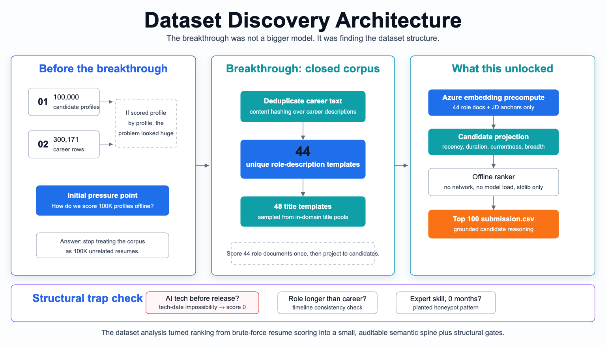
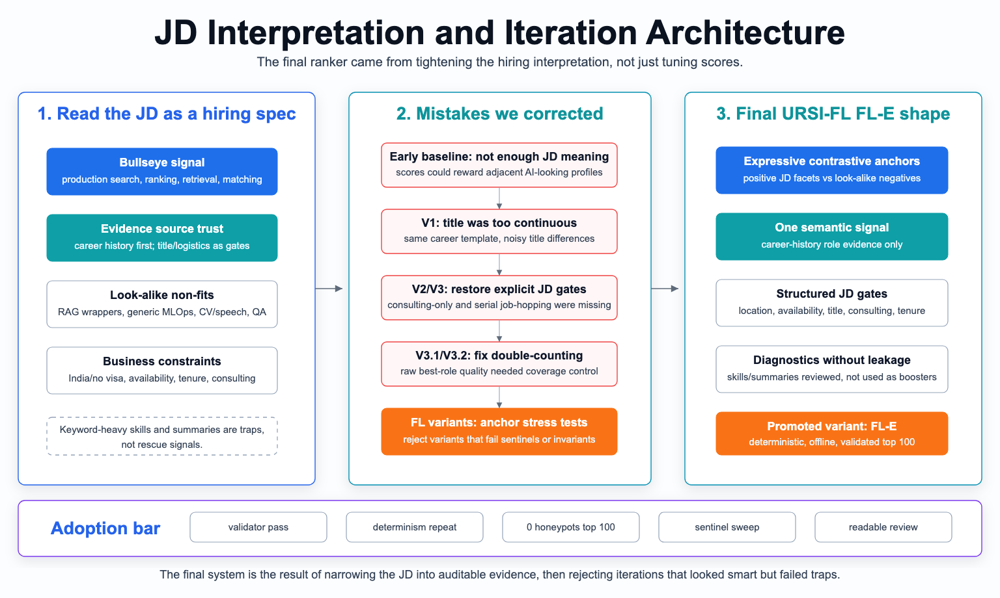
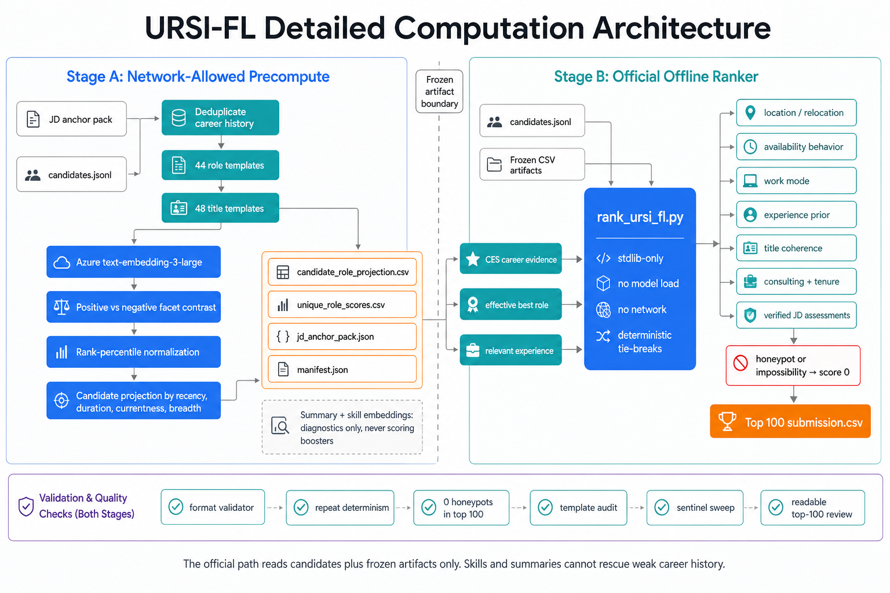
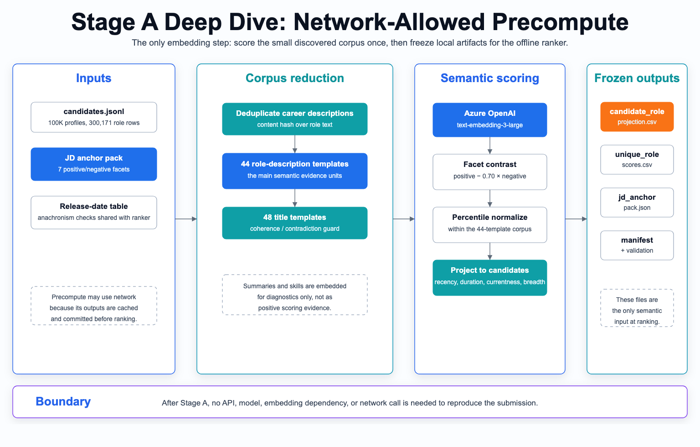
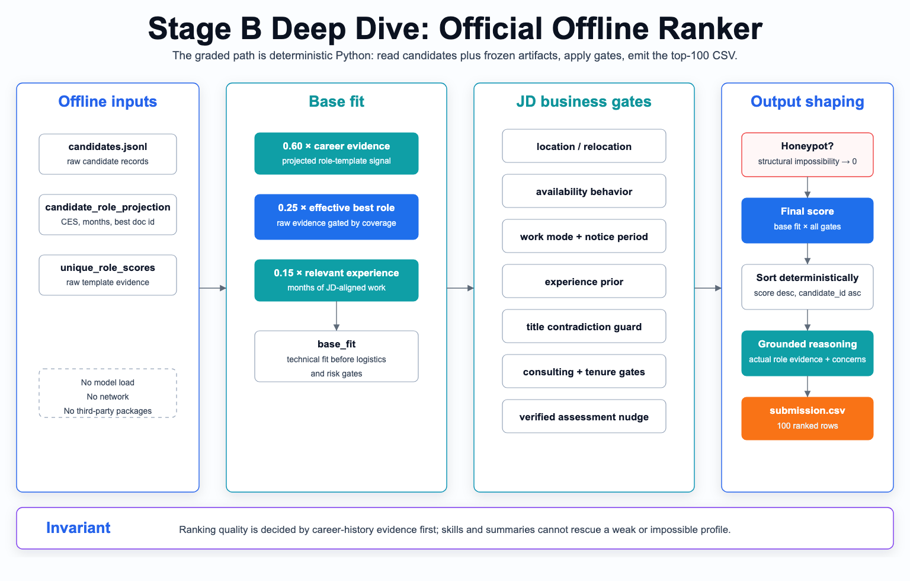

# URSI-FL — Redrob Intelligent Candidate Ranking

**Team 1Horizon** — [Tayyab Khan](https://github.com/tayyab415) · [Sahil Tanna](https://github.com/coldboxer007)

---

This repository is our final submission system for the **Redrob Intelligent
Candidate Discovery & Ranking Challenge**. The task sounds simple on paper:
find the best 100 candidates for Redrob AI's **Senior AI Engineer, Founding
Team** role. In practice, the released pool has **100,000 candidate profiles**
and **300,171 career-history rows**, so our first reaction was honestly: how do
we score this many profiles deeply, offline, and still keep the reasoning
grounded?

The first real breakthrough came from looking at the data instead of immediately
tuning the scoring formula. We discovered that the 300,171 career-history rows
were not 300,171 unique pieces of evidence. They deduplicated to only **44
unique career-history role-description templates** and **48 title templates**.

That changed the problem completely.

Before that point, the method looked like it needed to understand 100,000
profiles one by one. After that point, the better strategy was clear: understand
the **44 career templates** extremely well, because those templates were the
major evidence carriers in the dataset, then project that evidence back to each
candidate using their actual duration, recency, current role, title coherence,
availability, location, and other structured signals.



## Breakthrough: 100,000 Candidates, 44 Career Templates

The 44-template finding became the center of the whole approach. It told us
that the dataset was synthetic and closed, and that career-history descriptions
were the most reliable place to look for real role fit.

This also matched the job description. Redrob's JD warns that self-listed AI
skills can be misleading: someone can list every modern AI keyword and still
not be a fit if their actual work history is marketing, operations, support, or
generic wrapper work. So we decided not to let skills or summaries rescue a
weak career history.

So the semantic spine of the method is deliberately small and auditable:

- deduplicate career-history descriptions;
- score the **44 unique role documents** against the JD;
- compute title coherence over the **48 unique titles**;
- project role evidence back to candidates;
- use structured gates for availability, location, seniority, consulting-only
  careers, serial job-hopping, and honeypots.

This is why the final ranker is fast and offline. The expensive semantic work is
done once in precompute and frozen into CSV artifacts. The official submission
command only reads `candidates.jsonl` plus those local artifacts.

## Honeypot Moment: Fine-Tuning LLaMA Before LLaMA Existed

The second dataset moment was when we found profiles that were not merely weak
matches, but impossible profiles.

The clearest example was a repeated career-history template that looked strong
semantically but failed a date check. The template said the candidate had:

> Fine-tuned LLaMA-2-7B and Mistral-7B variants using LoRA and QLoRA for domain-specific candidate-JD matching.

It also described preference-pair generation from recruiter labels, a ranking
evaluation harness, BentoML/Kubernetes deployment, INT8 quantization, batching,
and a GPT-3.5 fallback. On meaning alone, that sounds very close to the JD. But
some roles carrying this template ended before LLaMA 2, Mistral-7B, QLoRA, or
GPT-3.5 were publicly available. We treated that as a factual impossibility,
not as a merely weaker fit.

We found the same class of issue in another template that described a RAG
customer-support chatbot using an answer-generation layer that was "initially
GPT-4, then a fine-tuned smaller model for cost control" inside roles ending
before GPT-4 was released.

So the honeypot rule became formal: semantic relevance can never override
timeline impossibility. If a role claims a technology before that technology
existed, or if its role timeline cannot be true, the candidate is not softly
penalized. The candidate scores 0.

The shared `ursi_fl_common.py` logic catches cases such as:

- role dates that predate the public release of a technology mentioned in the
  role description;
- a role lasting longer than the candidate's stated entire career;
- claimed experience exceeding what the timeline allows;
- expert-level skills with zero months of use.

On the full pool, the system zeroes **95** structurally impossible profiles and
places **0 honeypots in the top 100**.

## Job Description Overview

After the dataset pass, we stepped back from the metrics and asked a simpler
question: what is the JD actually asking for?

We interpreted it as a precision-search problem, not a generic "AI candidate"
problem. Redrob is not looking for someone who merely knows LLM tools or has
many AI keywords in their skills list. The role is for a hands-on founding-team
engineer who can build production search, retrieval, ranking, recommendation,
matching, or evaluation systems that connect candidates and jobs.

The target profile is therefore not "someone with many AI keywords." The target
is closer to:

- recent, hands-on production ML/search/retrieval/ranking work;
- evidence of evaluation rigor, such as ranking metrics, feedback loops, or
  online/offline evaluation;
- backend/data infrastructure that supports deployed ML systems;
- senior but still IC/hands-on experience;
- strong availability and logistics for an India-focused hiring process.

The JD also tells us what not to reward: AI-curious non-engineers, pure wrapper
projects, generic RAG chatbots, nontechnical current titles, consulting-only
careers, title-chasing job histories, and unavailable candidates.

## Initial Mistakes and Iterations

The earlier methodology files are useful because they show the mistakes and
corrections that led to the final system.

At the beginning, the scoring was too score-first. We were experimenting with
semantic similarity and candidate scoring before the JD interpretation was
sharp enough. That made some adjacent AI-looking profiles appear stronger than
they should have been.

Then we moved into anchor-based scoring. That was the right direction, but the
anchor design itself went through iterations. Some versions were too broad and
could reward generic AI language. Some were too narrow and missed plain-language
but highly relevant search/ranking work. Toward the end, we made the anchors
more expressive about the actual JD: production retrieval, ranking evaluation,
candidate-job matching, semantic search quality, matching/fine-tuning with
evaluation, and the negative look-alikes that the JD warns about.



The main corrections were:

1. **We moved from score-first to JD-first.** The target candidate definition
   had to come before the scoring formula.
2. **We stopped letting title noise reorder good candidates.** In this dataset,
   the same strong career template can appear under several relevant titles.
   V1 treated title coherence too much like a continuous score. Later versions
   made title a contradiction guard instead of a booster.
3. **We restored JD-named negative gates.** The JD explicitly warns about
   consulting-only careers and title-chasing. Earlier URSI versions had dropped
   those baseline gates, so V3 restored them as negative-only multipliers.
4. **We fixed best-role double-counting.** V3.1 separated raw best-role quality
   from projected duration. V3.2 then gated that raw uplift by relevant-month
   coverage so one short strong role could not borrow full top-template credit.
5. **We rejected tempting anchor variants.** Some FL variants improved one
   narrow gap but admitted sentinel false positives. FL-E was promoted because
   it passed the validator, determinism check, honeypot audit, template audit,
   sentinel sweep, and readable top-100 review.

The final result is **URSI-FL, variant FL-E**: Unified Role Semantic Index with
fixed-leak anchors and conservative business gates.

## Major Methodology: URSI-FL FL-E

URSI-FL treats the problem as hybrid retrieval with a clean boundary between
precompute and official ranking.



### Stage A: Network-Allowed Precompute

The optional precompute step uses Azure OpenAI `text-embedding-3-large` to embed
only the compact discovered corpus:

- 44 career-history role templates;
- 48 title templates;
- JD-derived positive and negative anchors;
- diagnostics-only summary and skill templates.

Each role document is scored through contrastive JD facets: what the JD wants
versus what the JD warns can look similar but is not the role. The resulting
role evidence is percentile-normalized inside the closed 44-template corpus and
saved into frozen CSV artifacts under:

```text
artifacts/role_semantic_index_fl/fl_e/
```

Profile summaries and self-listed skills are embedded only for diagnostics and
false-positive review. They do **not** act as scoring boosters. Redrob-verified
skill assessments are used only as a tiny bounded confirmation factor
(`[0.99, 1.02]`) after the career history already fits.

### Stage B: Official Offline Ranker

The official ranker is:

- CPU-only;
- offline;
- deterministic;
- Python standard-library only;
- no model load;
- no network calls.

It combines career-history evidence with structured JD gates:

```text
base_fit = 0.60·career_evidence
         + 0.25·effective_best_role
         + 0.15·relevant_experience

score = base_fit × location × behavior × work_mode × experience
               × title_coherence × consulting × tenure
               × verified_assessment_confirmation

honeypot or structural impossibility => score 0
```

The output is a 100-row CSV with grounded, deterministic 1-2 sentence reasoning
for every selected candidate.

### Stage A Diagram: Precompute in Detail

Stage A is where all embedding-dependent work happens. The design goal was to
make this step rich enough to capture the JD, but small enough to audit. It
embeds the 44 role templates, 48 title templates, and JD anchors once, then
freezes the resulting evidence into local artifacts.



The important boundary is that Stage A can use Azure OpenAI because it is not
the graded ranking command. Once the artifacts are written, the official path no
longer needs any hosted model, API key, or network access.

### Stage B Diagram: Offline Ranker in Detail

Stage B is the official reproduction path. It reads the organizer-provided
`candidates.jsonl`, the frozen Stage A CSVs, and then applies deterministic
scoring and gates. The ranker is deliberately plain Python: no model loading,
no network, no third-party package dependency.



This is also where the method stays conservative. Career-history evidence sets
the technical base fit, while logistics, title contradiction, consulting,
tenure, verified-assessment confirmation, and honeypot checks act as bounded
or negative controls.

## Quickstart: Reproduce the Submission

```bash
# 1) Clone this repo, then place the released dataset next to it.
#    candidates.jsonl is distributed by the organizers and is not redistributed here.
#    If you only have the .gz bundle:
gunzip -k candidates.jsonl.gz

# 2) Create a clean virtual environment.
python3 -m venv .venv
source .venv/bin/activate          # Windows: .venv\Scripts\activate
python -m pip install --no-index -r requirements.txt

# 3) Run the official ranker: offline, CPU-only, no model load, deterministic.
python3 rank_ursi_fl.py \
  --candidates ./candidates.jsonl \
  --role-projection ./artifacts/role_semantic_index_fl/fl_e/candidate_role_projection.csv \
  --out ./submission.csv

# 4) Validate the output format.
python3 validate_submission.py submission.csv
```

Step 3 is the single command that reproduces the submitted top-100 CSV from
`candidates.jsonl` and the frozen local artifacts.

For one-command local reproduction:

```bash
./reproduce.sh ./candidates.jsonl ./submission.csv
```

The helper creates or reuses `.venv`, installs `requirements.txt` with
`--no-index`, runs the ranker, and validates the generated CSV.

Measured on the reference machine (Apple M2, 8 CPU cores, 8 GB RAM, Python
3.11.4, macOS 14.8.7): **about 35 seconds wall-clock** and **about 1.7 GB peak
RSS** for the full 100,000-candidate pool. Repeated runs are byte-identical;
ties are broken by ascending `candidate_id`.

## Submission CSV Contract

The generated submission must use exactly this header:

```text
candidate_id,rank,score,reasoning
```

It must contain:

- exactly 100 data rows;
- unique `candidate_id` values in `CAND_XXXXXXX` format;
- ranks `1` through `100`, each exactly once;
- float scores in non-increasing rank order;
- ascending `candidate_id` as the deterministic tie-breaker for equal scores;
- grounded reasoning tied to actual candidate evidence.

`validate_submission.py` checks this format contract. Passing the validator is
necessary, but ranking quality still comes from the methodology and audits.

## Optional: Rebuild the Precomputed Artifacts

The official ranker consumes frozen CSV artifacts already committed in this
repo. You do not need to rebuild them to reproduce `submission.csv`.

They were produced once, network-allowed, by:

```bash
export AZURE_OPENAI_API_KEY="your-azure-openai-key"
export AZURE_OPENAI_RESOURCE_URL="https://<your-resource>.openai.azure.com"
python -m pip install -r requirements-precompute.txt
python3 precompute_role_semantic_index_fl.py \
  --candidates ./candidates.jsonl \
  --variant fl_e \
  --out-dir ./artifacts/role_semantic_index_fl/fl_e
```

This embeds the 44 role documents, 48 titles, and FL-E anchor pack with Azure
OpenAI `text-embedding-3-large`. Embeddings are used only here, never during
official ranking.

## Docker Reproduction

Build the image and mount the organizer-provided `candidates.jsonl`:

```bash
docker build -t redrob-ursi-fl .
docker run --rm \
  -v "$PWD/candidates.jsonl:/app/candidates.jsonl:ro" \
  -v "$PWD/docker_out:/out" \
  redrob-ursi-fl \
  python rank_ursi_fl.py \
    --candidates /app/candidates.jsonl \
    --role-projection /app/artifacts/role_semantic_index_fl/fl_e/candidate_role_projection.csv \
    --out /out/submission.csv
docker run --rm -v "$PWD/docker_out:/out" redrob-ursi-fl \
  python validate_submission.py /out/submission.csv
```

## Running on a Small Sample

For sandbox or demo smoke tests, `rank_ursi_fl.py` accepts `--limit N` and
`--top-n N`:

```bash
python3 rank_ursi_fl.py \
  --candidates ./candidates.jsonl \
  --limit 50 \
  --top-n 50 \
  --role-projection ./artifacts/role_semantic_index_fl/fl_e/candidate_role_projection.csv \
  --out ./sample_out.csv
```

Partial outputs are for demonstration only. Official submissions should use the
default `--top-n 100` and pass `validate_submission.py`.

## Repository Map

- `rank_ursi_fl.py` — official offline ranker.
- `ursi_fl_common.py` — shared JD anchors, date logic, and honeypot logic.
- `precompute_role_semantic_index_fl.py` — optional network-allowed artifact
  builder.
- `artifacts/role_semantic_index_fl/fl_e/` — frozen FL-E artifacts consumed by
  the ranker.
- `submission.csv` — reproduced top-100 output. Rename only when uploading to
  the portal if the organizer requires a participant-ID filename.
- `validate_submission.py` — CSV format validator.
- `submission_metadata.yaml` — portal-style metadata: team identity,
  reproducibility, compute declaration, AI-tools declaration, and methodology
  summary.
- `METHODOLOGY_URSI_FL.md` — definitive methodology for the submitted system.
- `URSI_FL.md`, `URSI_V3.md` — iteration history and adoption rationale.
- `requirements.txt` — official ranking dependencies; intentionally empty of
  third-party packages.
- `requirements-precompute.txt` — optional precompute dependency file.
- `reproduce.sh` — local reproduction helper.
- `Dockerfile` / `.dockerignore` — container reproduction path.
- `assets/architecture-diagrams/` — architecture diagrams used in this README
  and methodology explanation.

## Validation Evidence

The final FL-E path was adopted only after the following checks:

- format validator passes;
- repeated ranking run is byte-identical;
- 0 honeypots in the top 100;
- top-100 readable review completed;
- false-positive sentinels checked: nontechnical titles, operations/content,
  RAG support chatbot, generic MLOps/churn, QA/test automation, consulting-only,
  serial-hopper, and CV/speech/robotics-without-IR patterns;
- anchor leave-one-out and template audits documented in
  `METHODOLOGY_URSI_FL.md` and `URSI_FL.md`.

## AI Tools Declaration

See `submission_metadata.yaml` for the full declaration. Summary: AI tools
assisted with research, design discussion, code review, and packaging. Azure
OpenAI `text-embedding-3-large` is used only in the precompute step to generate
frozen local artifacts. The official ranker makes no API calls and loads no
model.

## Sandbox / Demo

A hosted sandbox link is listed in `submission_metadata.yaml` under
`sandbox_link`. If the hosted sandbox is unavailable, the Docker commands above
are the self-contained reproduction path: build the ranker image and run it
with the released candidates file mounted read-only.
